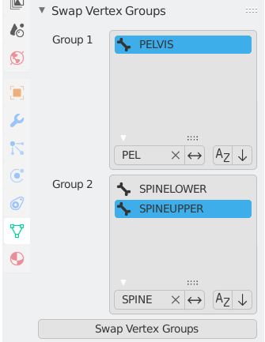

# Blender Swap Vertex Groups Addon
Blender addon to swap vertices between user-selected vertex groups.

## Install
1. Download and unzip this repository.
2. Edit > Preferences > Addons > Install
3. Choose `swap_vertex_groups.py` from the unzipped folder.
4. Click the checkbox next to the addon name to enable it.

## Use
The swapping panel is listed in the object data tab in the properties window. Select one vertex group/bone from each list and press "Swap Vertex Groups" to swap their vertices.

Vertex swapping is not available for objects without a pose and non-mesh objects.

## Update or Uninstall
1. Edit > Preferences > Addons
2. Find "Swap Vertex Groups" inm the addons list and expand it.
3. Press "Remove."
4. Re-download the addon and follow the [installation instructions](#Install).
